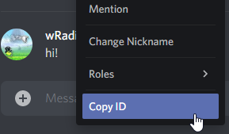
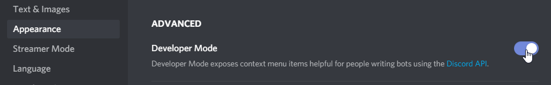

# 10FF Roles Request Bot

# ⚠ Please read:

## This bot only gives the WPM, the achievements (Supporter, Translator, Completionist) and the Multilingual role automatically using your 10FF profile page.

## If you wish to submit a video to have the Verified ✅ role, don't use the command: send a message with your 10FF profile and a link to the video, and wait for a moderator.

## If you want to have the self assignable roles (Qwerty, 10 Fingers, english, ...) go to the #self-assignable-roles channel.

## Index
1. [Summary](#summary)
2. [Request Queue](#request-queue)
3. [Identification](#identification)
4. [Roles](#roles)
    - [Roles Removal](#roles-removal)
    - [WPM Roles](#wpm-roles)
      - [Competitions](#competitions)
      - [Language](#language)
    - [10FF Supporter, Site Translator and Completionist](#10ff-supporter-site-translator-and-completionist)
    - [Multilingual](#multilingual-keyboard) :keyboard:
    - [Verified](#verified-) ✅
5. [Known Issues](#known-issues)
6. [Bug, issues, suggestions](#bug-issues-suggestions)

## Summary

Usage:
```
!roles <your 10FF profile URL>
```

Example:
```
!roles https://10fastfingers.com/user/209050/
```

The command only works in the **#role-requests** channel.

Please be patient with the bot. A single request can take up to 20 or 30 seconds.

## Request Queue

Because of server limitations, the command works with a **queue system**. The bot will tell you the position you are in, and it will send a message whenever your request is being processed.

## Identification

You will need to put your **Discord Tag** (e.g. **Discord#0000**) OR **Discord ID** in your 10FF Profile **description** so the bot will be able to check that it's your profile.

Don't worry, your Discord ID is not a sensitive data to share. Everyone can have it.

To get your Discord ID, just right-click your name on Discord and click "**Copy ID**".



If the **Copy ID** button is not present, you will have the enable the **Developer Mode** (_Settings > Appearance > Advanced > Developer Mode_).



## Roles

This bot gives those roles automatically:
- **10FF Supporter ❤**
- **Site Translator ✒**
- **Completionist**
- **Multilingual :keyboard:**

Plus **WPM** and **WPM (Advanced)** roles.

Plus **Tests Taken** roles.

Plus **Competitions Taken** roles.

### Roles Removal

The bot can **remove** a role from you if your profile don't meet the new requirements.

### WPM roles

If you're not happy with your WPM roles (if you wish to use your average instead of your max), you can specify your requested roles for normal and advanced:
```
!roles https://10fastfingers.com/user/209050/ 150 130
```
Even though I can have the **170-179 WPM** and the **140-149 WPM (Advanced)** roles with the max detected scores, the command above will give me the **150-159 WPM** and **130-139 WPM (Advanced)** roles.

Obviously, you can't request a WPM role that is higher that your highest score. The bot only sees your last **400 tests** (normal and advanced).

#### Competitions

For now, the competitions are not read by the bot. But it will be possible to specify a competition URL if you did your record there.

#### Language

If your main language (the language in which you did the most tests) is not the language you wish to use for your WPM roles, you can specify it in the command:
```
!roles https://10fastfingers.com/user/209050/ english
```

Currently, all languages are supported except for **Chinese (Traditional)** and **Chinese (Simplified)**.

### 10FF Supporter, Site Translator and Completionist

The bot will check if you have the achievement corresponding to the role.

### Multilingual :keyboard:

The condition to have the **Multilingual :keyboard:** role is as follows: you need to have at least **50 tests** in **10 languages**.

### Verified ✅

If you have the **Verified ✅** role and your new WPM (normal or advanced) is higher, the bot will automatically remove your **Verified ✅** role.

Someone will have to check manually your new speed to (re)add you the role.

## Known issues

- If you have a WPM role (ex 150-159 WPM) and you do 400+ tests between 140-149 WPM, your 150-159 WPM role will be replaced by 140-149 WPM
- In some cases, the bot says that it added/removed roles, but you still have your old roles, just type the command again (and delete your old command message)
- You can ask a friend to add your Discord tag in his description to have his roles (please don't do that...)
- Sometimes the bot message is stuck on "_Please wait..._" (for more than 1 or 2 minutes), just type the command again (and delete your old command message)
- Some invalid arguments just crash the bot. In that case, I have to manually restart the bot. I'll try to look in the **#role-requests** channel regularly but eventually this issue will be fixed

## Bug, issues, suggestions

If you have any problem with the bot please feel free to report the bugs to me on Discord (**wRadion#5043**) or by email [me@wradion.dev](mailto:me@wradion.dev). You can also find me on the official 10FF Discord.
